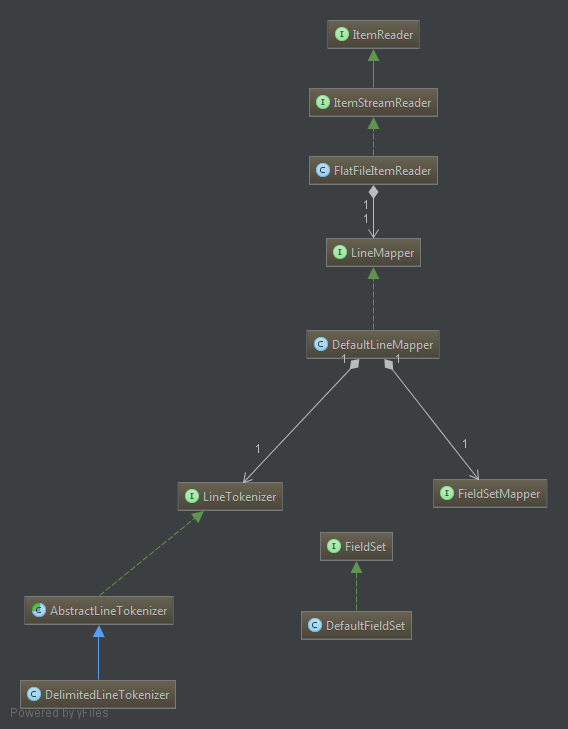

https://github.com/acogoluegnes/Spring-Batch-Workshop/blob/master/presentation/spring-batch-workshop.pdf - good презентация
http://www.javaworld.com/article/2458888/spring-framework/open-source-java-projects-spring-batch.html?page=4
http://stackoverflow.com/questions/25129185/complex-xml-using-spring-batch-staxeventitemwriter-jaxb2marshaller - xml header and footer

**Настройка Job**

**commit-interval** - параметр обределяющий размер порции(chunk), которыми будет писать ItemWriter<T>.write(items). Размер chunk'а.
**skip-limit** - максимальнно кол-во ошибок в порции(chunk), которое будет отлено и обработано - иначе эксепн прервет Job и Exit Status : **FAILED**.
Если определен skip-limit, то и обязятельно должна быть определена секция  **<skippable-exception-classes>**

**Логика игнорирования ошибок: <skippable-exception-classes>**
    в этой секции должны быть перечислены все исключении, которые могут быть проигнорированы в пределах одного чанка не более skip-limit раз. (см: доку)
       
        <batch:job id="priceCsvToXmlConvertionJob">
            <batch:step id="step2">
                <batch:tasklet>
                    <batch:chunk reader="priceReader"
                                 writer="staxXmlItemWriter"
                                 processor="priceItemProcessor"
                                 commit-interval="10" skip-limit="10">
    
                        <batch:skippable-exception-classes>
                            <batch:include class="org.springframework.batch.item.file.FlatFileParseException"/>
                        </batch:skippable-exception-classes>
    
                    </batch:chunk>
    
                    <batch:listeners>
                        <batch:listener ref="skipListener" />
                    </batch:listeners>
    
                </batch:tasklet>
            </batch:step>
        </batch:job>
        
    Листенеры отрабатывают после кажого чанка.
        
**commit-interval="10" skip-limit="4"** - порции по 10 строк, кол-во ошибок не более 4.

**1. Этап чтения данных и иреобразования их в бизнес модель:**

**ItemReader<T>** - задача объектов данного класса: считывать данные из источника и преобразовывать их в модель данных T, по одной за раз. Основной метод: T read().

**FlatFileItemReader<T>** - источник - flat файлы. Построчно считывает строку в flat файле и преобразует её в T. Данный объект содержит источники данных (Файловые ресурсы) и маппер.
Все эксепшены внутри работы этого ридера оборачиваютсся во FlatFileParseException.

**DefaultLineMapper**(LineMapper) - собственно сама инкапсуляция алгоритма преобразования строки в объект T. Процесс трансформации строки: Строка данных -> FieldSet -> T (модель).
Таким образом DefaultLineMapper разделяет её на два настраиваемы этапа, делегируя их выполнение двум классам: Токинайзеру и FieldSet мапперу.

**DelimitedLineTokenizer**(LineTokenizer) - инкапсуляция алгоритма разбора строки на слова и сохранения их в контейнер слов FieldSet. В свойстве names должен содержать список имён столбцов.
**FieldSetMapper** - преобразует FieldSet в модель T. В стандартном use-case именно здесь находится точка кастомизации. Т.е. нам нужно реализовать свой FieldSetMapper.

Процесс трансформации: Строка данных -> **FieldSet** -> **T (модель)**.
**FieldSet** - контейнер хранящий слов из входной строки, имеющий интерфейс доступа к словам по имени столбца или индекса.

**Пример настройки FlatItemReader'а**

        <bean id="reader" class="org.springframework.batch.item.file.FlatFileItemReader">
            <property name="linesToSkip" value="1"/>
            <property name="encoding" value="UTF-8"/>
            <property name="lineMapper">
                <bean class="org.springframework.batch.item.file.mapping.DefaultLineMapper">
                    <property name="lineTokenizer">
                        <bean class="org.springframework.batch.item.file.transform.DelimitedLineTokenizer">
                            <property name="delimiter" value=";"/>
                            <property name="names" value="firstname,lastname,birth" />
                            <property name="strict" value="true"/>
                        </bean>
                    </property>
                    <property name="fieldSetMapper">
                        <bean class="ru.oz.mytutors.CustomFieldSetMapper" >
                            <property name="dateFormat" value="yyyy-MM-dd"/>
                        </bean>
                    </property>
                </bean>
            </property>
            <property name="resource" value="classpath:contacts.txt" />
        </bean>
		
**2. Этап обработки бизнес модели согласно бизнес логике:**
**ItemProcessor<T>**

**3. Этап сохранение бизнес моделей**
**ItemWriter<T>**

**Чек лист**
 1. Написать 
 1. Настройка Joba